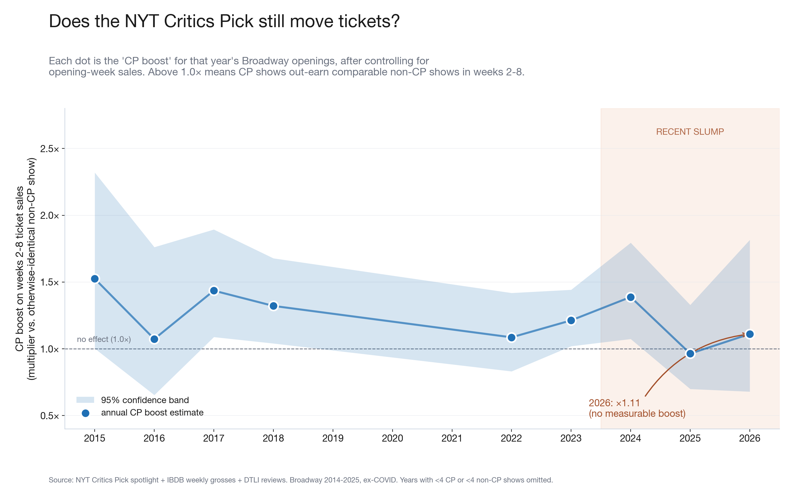
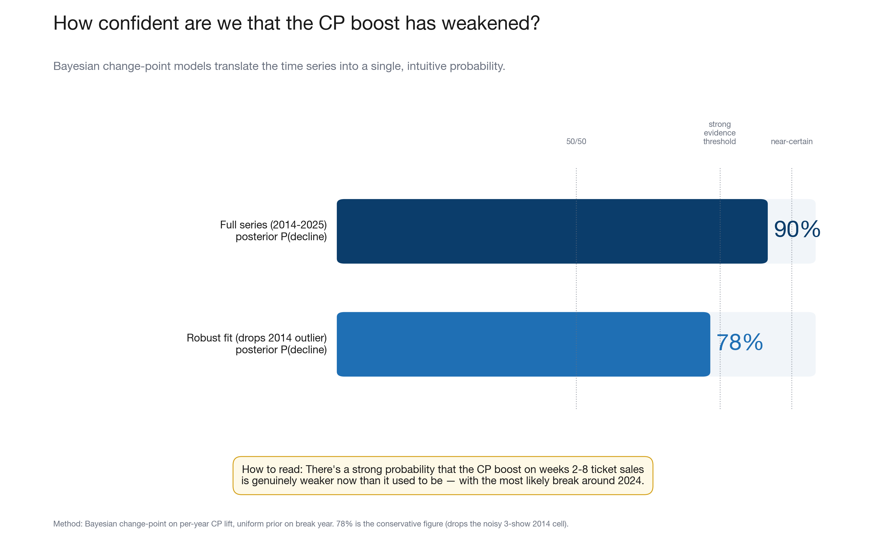
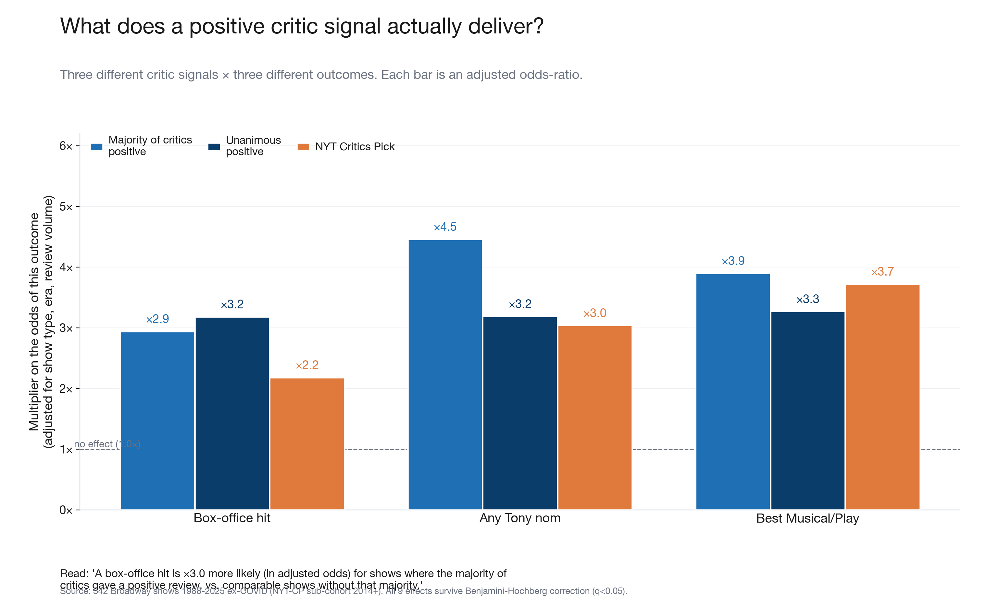
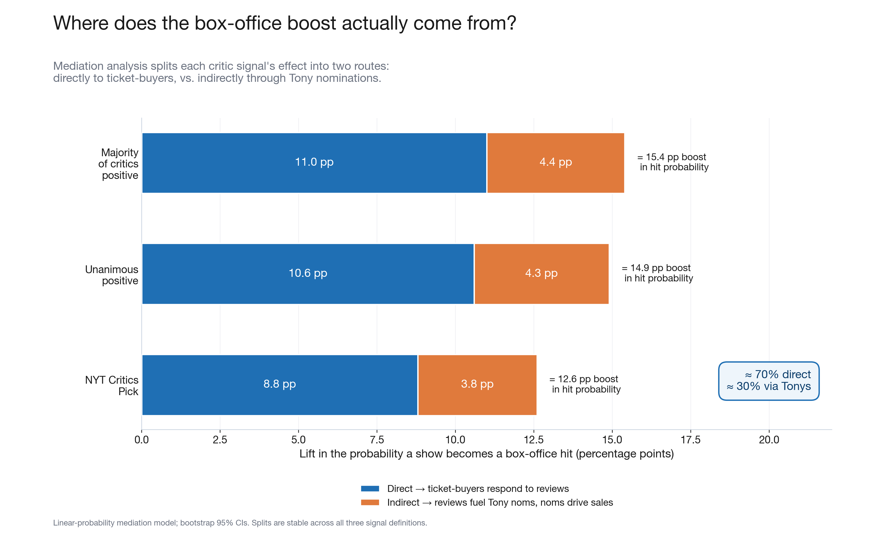
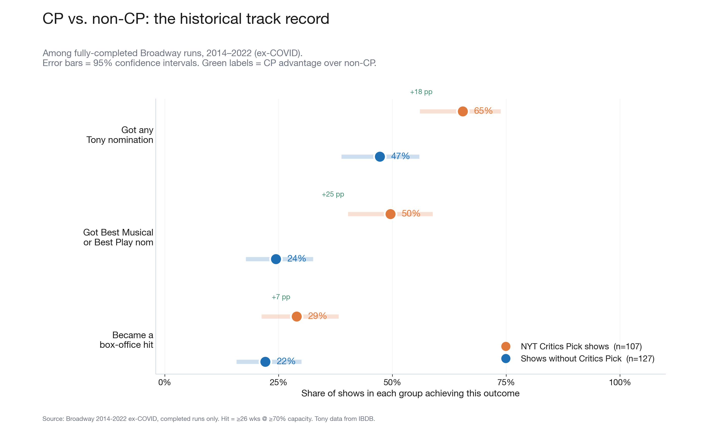

# Does the *Critics' Pick* Still Matter?

A data-driven look at whether the New York Times' "Critics Pick" badge still moves Broadway ticket sales — and what theater critics in general are worth to the box office in 2026.

> **TL;DR.** Critics still matter. Across 1988–2025, a Broadway show with majority-positive reviews was 2.9× more likely to become a box-office hit and 4.5× more likely to land a Tony nomination than one without. But the *specific* NYT Critics Pick boost on post-launch ticket sales has been weakening: a Bayesian change-point model puts the probability of a real decline starting around 2024 at **78%–90%**. The 2025 season is the first in the dataset where CP shows showed *no* measurable post-launch advantage over comparable non-CP shows.

---

## The Five Charts

### 1. Has the CP boost weakened over time?



Each dot is one year of openings. The dot's height shows how much more money CP shows earned in their first two months *vs. otherwise-identical non-CP shows that opened the same year*. Above 1.0× means CP shows out-earned. The boost stayed between 1.2× and 1.5× for nearly a decade; the 2025 season is the first year it sat below 1.0×.

### 2. How confident are we?



The full series gives 90% posterior probability of a real decline; a robust re-fit (dropping the noisy 3-show 2014 cell) gives 78%. Both well above 50/50, but short of the conventional 95% "near-certain" threshold. The most likely break-point year, in the robust fit, is **2024**.

### 3. What do critics actually deliver, across all eras?



Pooled across 489 Broadway shows (1988–2025, ex-COVID), critics matter for both audiences and award voters — but the *which-signal-wins-which-outcome* split is interesting. Broad critical consensus dominates the box-office. The NYT Critics Pick specifically dominates *Best Musical / Best Play* — Tony voters watch the NYT.

### 4. Where does the box-office boost come from?



About 70% of the box-office advantage from good reviews is direct (audiences buy tickets after reading the rave). About 30% runs through the Tony pipeline (good reviews drive Tony nominations, nominations drive ticket sales). Producers who want a commercial hit need both, but the direct critic-to-audience channel is by far the larger of the two.

### 5. CP vs. non-CP shows: the historical scorecard



Across fully-completed Broadway runs 2014–2022, the CP badge is most powerful as a Best Musical / Best Play–nom predictor (+25 pp). Any-Tony-nomination is +18 pp. Box-office is +7 pp — real but smaller, consistent with the finding that audiences respond more to a *crowd* of positive reviews than to one outlet on its own.

---

## The Findings in Numbers

### Adjusted odds-ratios (logit; controls: show type, year, post-COVID, log-reviews)

| Signal | Cohort | Any Tony nom | Best Musical/Play nom | Box-office hit |
|---|---|---|---|---|
| Majority of critics positive | 1988-2025, n=489 | **×4.5** | **×3.9** | **×2.9** |
| Unanimous positive | 1988-2025, n=489 | **×3.2** | **×3.3** | **×3.2** |
| NYT Critics Pick | 2014+, n=300 | **×3.0** | **×3.7** | **×2.2** |

All effects survive Benjamini–Hochberg FDR correction at q < 0.05.

### Decline analysis (per-year CP lift on weeks 2-8 gross)

| Year | n CP | n total | CP lift | 95% CI |
|---|---|---|---|---|
| 2015 | 17 | 34 | ×1.32 | [1.00–1.75] |
| 2018 | 15 | 21 | ×1.34 | [1.03–1.76] |
| 2023 | 6 | 23 | ×1.21 | [1.02–1.44] |
| 2024 | 12 | 26 | ×1.28 | [1.00–1.63] |
| **2025** | **11** | **22** | **×0.95** | **[0.69–1.29]** |

### Bayesian change-point posterior

| Model | P(real decline) | Most likely break year |
|---|---|---|
| Full series (2015-2025) | **90%** | after 2014 (driven by small-n outlier) |
| Robust (drops years with <5 CPs) | **78%** | **after 2024** |

---

## Reproducing the analysis

The committed SQLite DB (`data/critics_impact.db`, 11 MB) contains every show, review, weekly gross, and Tony outcome used. To regenerate every number above:

```bash
pip install -r requirements.txt

python3 analysis/01_consensus_models.py    # Section "Findings in Numbers" – adjusted ORs
python3 analysis/02_decline_analysis.py    # Decline test + Bayesian change-point
python3 analysis/03_generate_charts.py     # Re-renders charts/1..5.png
```

---

## What's in this repo

```
.gitignore  LICENSE  README.md  requirements.txt
analysis/
  01_consensus_models.py     adjusted ORs, mediation, Cox survival
  02_decline_analysis.py     per-year lift + Bayesian change-point
  03_generate_charts.py      produces all five charts
charts/                      5 PNGs at 200-300 dpi
data/critics_impact.db       SQLite database (11 MB)
```

---

## How the database was built

The `critics_impact.db` consolidates four public sources:

| Source | What it provides |
|---|---|
| [Did They Like It?](https://didtheylikeit.com) | Critic reviews, sentiment, publication |
| BroadwayWorld | Weekly grosses, capacity %, attendance |
| [NYT spotlight page](https://www.nytimes.com/spotlight/theater-critics-picks) | Critics Pick flags |
| IBDB + Wikipedia | Tony nominations and wins |

Three critic signals are tested side-by-side:
- **Majority positive** — more than half of opening-window reviews are positive
- **Unanimous positive** — every opening-window review is positive (≥ 2 reviews)
- **NYT Critics Pick** — the show carries the official NYT CP badge

Against three outcomes:
- **Box-office hit** — ran ≥ 26 weeks at ≥ 70% capacity
- **Tony nomination** — any nomination in any category
- **Top Tony** — Best Musical or Best Play nomination

---

## Important caveats

- **Associations, not causal effects.** Critically acclaimed shows tend to have bigger budgets, stronger casts, and better creative teams. We don't have capitalization data, so some of what looks like a "critic effect" is actually "underlying quality" that critics noticed at the same time audiences did. Treat effect sizes as upper bounds.
- **Annual CP sample size is the binding constraint** — only ~12-14 NYT Critics Picks per year on Broadway. That's why the Bayesian posterior (~78%) is the right tool; a binary frequentist p-test won't have power.
- **Right-censoring on recent shows.** Shows still running at the data cutoff are excluded from the binary hit definition.

---

## License

[MIT](LICENSE).

_Last data refresh: 2026-05-17 (grosses). Analysis cutoff: 2026-05-25. Charts at 220 dpi._
