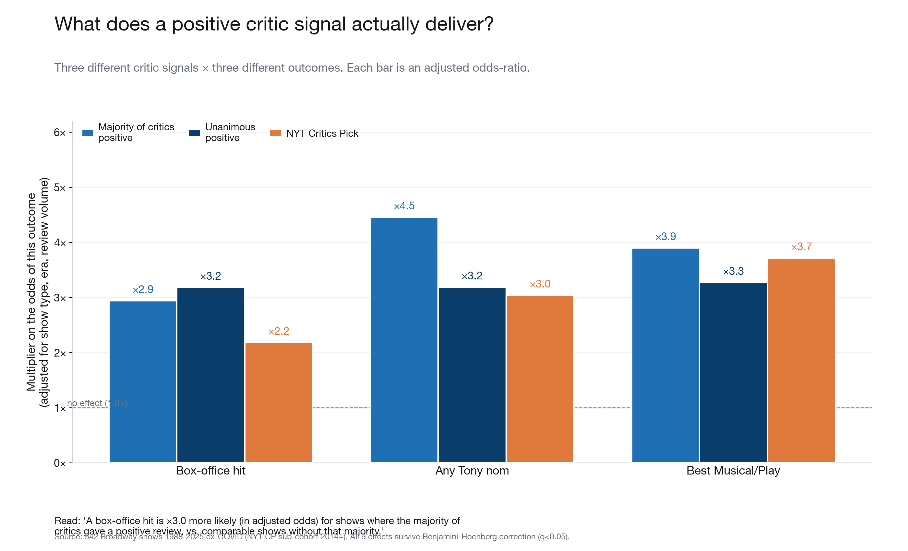
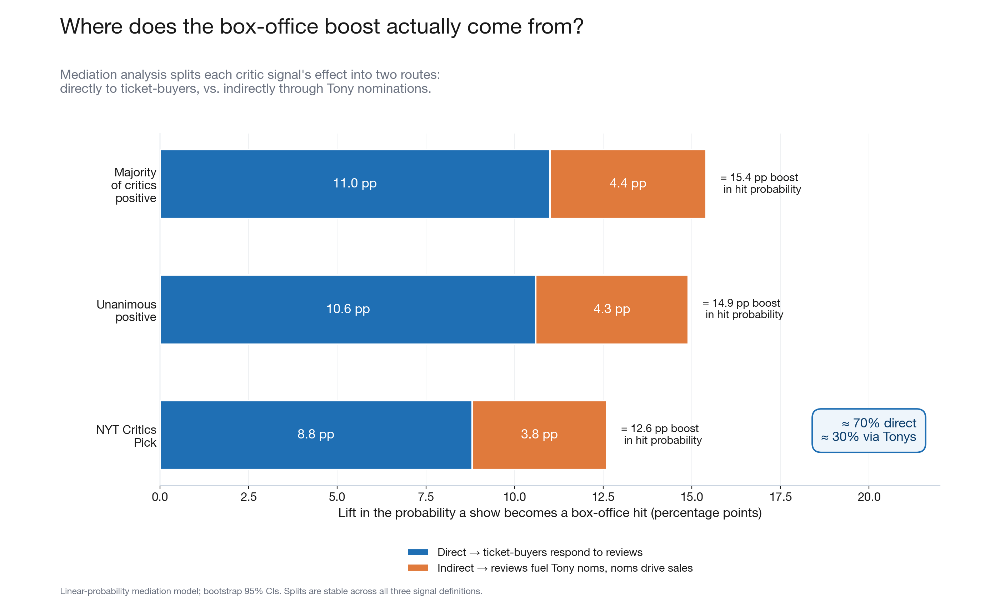
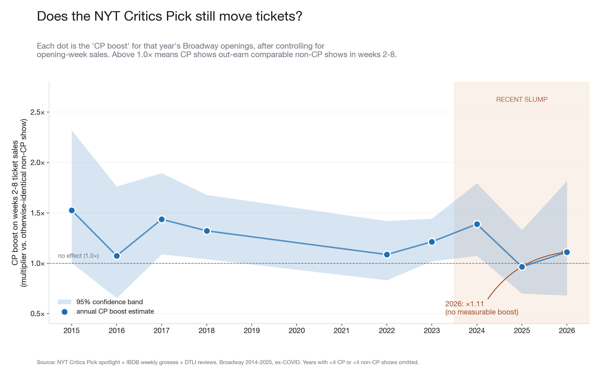
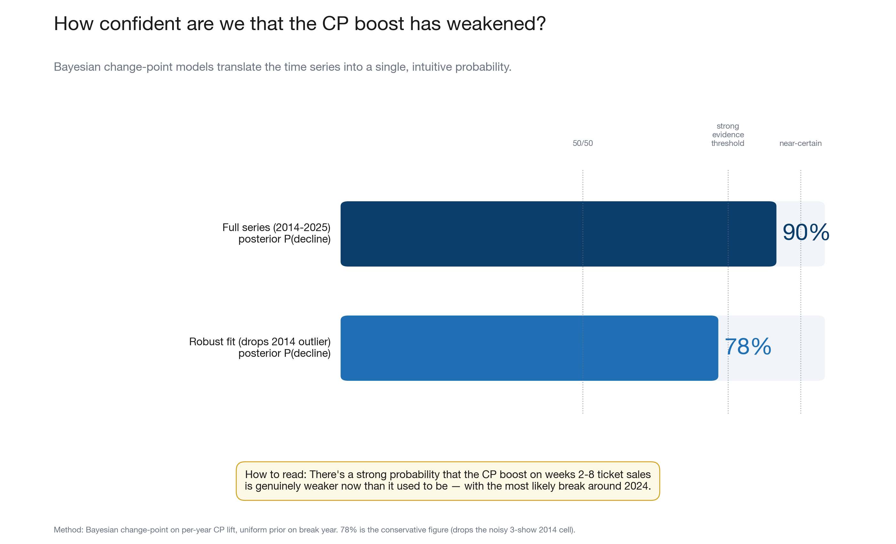

# Do Theater Critics Still Matter? — Plain English Report

_Based on 542 Broadway shows, 1988–2026. Analysis completed May 26, 2026._

---

## The Short Version

**Critics still matter — but there are early signs the NYT Critics Pick has lost some of its punch, particularly in 2024 and 2025.**

For most of the past decade, when the New York Times gave a show its coveted "Critics Pick" badge, that show earned noticeably more money in the weeks after opening — on average about **18% more** in weeks 2 through 8 than a comparable show without the badge. That boost has been shrinking since 2024. In the 2025 season, for the first time, CP shows actually came in *slightly below* non-CP shows in post-opening momentum.

That's the headline. Everything below unpacks what we actually found, how confident we are, and what it means.

---

## Part 1: Do Critics Matter at All?

Yes — substantially. When the majority of critics loved a show, good things followed:

### Chart: What Critics Actually Deliver

All figures below are *adjusted* odds-ratios — they hold show type, era, post-COVID, and review volume constant. Think of them as "after we account for the obvious other stuff, how much does the critic signal alone move the odds?"

**Box office** (did the show become a hit?):
- Majority of critics positive → **~2.9× more likely** to become a box-office hit.
- Unanimous positive → **~3.2× more likely**.
- NYT Critics Pick → **~2.2× more likely**.

**Tony Awards** (did the show get recognized?):
- Majority positive → **~4.5× more likely** to get *any* Tony nomination.
- NYT Critics Pick → **~3.0× more likely** to get any Tony nomination.
- For a *Best Musical / Best Play nomination specifically*, the NYT Critics Pick (~3.7×) is essentially tied with broad consensus (~3.9×) as the strongest predictor.

**The takeaway**: Critics move the needle both with audiences *and* with Tony voters, and they do it through two different channels.

---

## Part 2: How Does the Critics' Boost Actually Work?

When critics rave about a show, the box-office benefit flows through two routes:

### Chart: Where the Box-Office Boost Comes From

1. **Directly** — Audiences read the reviews, decide to buy tickets. This accounts for roughly **70%** of the boost.
2. **Through the Tonys** — Great reviews help a show get Tony nominations. Tony nominations then drive their own wave of ticket sales. This accounts for roughly **30%** of the boost.

This 70/30 split holds for all three types of critic signals we measured. The important implication: critics carry their own commercial weight with audiences *without needing Tony validation*. The Tony pipeline is real but secondary.

**For a producer**, this means: if you want a show to become a commercial hit, you want a broad critic rave — not just the NYT's blessing. If you want to win a Tony, you specifically want the NYT on your side.

---

## Part 3: The Historical Track Record

### Chart: CP vs. Non-CP Shows, 2014–2022

Among fully-completed Broadway runs from 2014 through 2022 (avoiding the COVID years and shows that are still open):

| Outcome | With NYT Critics Pick | Without | Difference |
|---|---|---|---|
| Became a box-office hit | **29%** | 22% | +7 pp |
| Got Best Musical / Best Play nomination | **50%** | 24% | +25 pp |
| Got any Tony nomination | **65%** | 47% | +18 pp |

(n = 107 CP shows, 127 non-CP shows; 2014–2022 Broadway, ex-COVID; 95% Wilson CIs in the chart.)

The CP badge is most powerful as a Best-Musical/Play-nom predictor (+25 percentage points — more than doubling the rate). Its box-office advantage (+7 pp) is real but smaller, consistent with the head-to-head finding (Section 1 above) that audiences respond more to a *crowd* of positive reviews than to a single outlet.

---

## Part 4: Is That Boost Getting Weaker?

This is the core question — prompted by high-profile CP flops like *Queen of Versailles* and *Redwood* in recent seasons.

### Chart: The CP Boost Over Time

The chart shows, for each year, how much extra money CP shows earned in their first two months *compared to otherwise-similar non-CP shows* that opened the same year. A value of 1.0× means no CP advantage; 1.5× means CP shows earned 50% more in that window.

**What the chart shows**:
- From 2015 through 2024, the CP boost mostly stayed between ×1.2 and ×1.5 — genuinely positive but not transformative.
- In **2025**, for the first time, the estimate dips to ×0.95 — technically *below* 1.0×, meaning no measurable CP advantage that year.
- The most recent data (2026 season) is still incomplete; only a fraction of that year's shows have enough weeks to measure.

**Is this a trend or noise?** Read on.

---

## Part 5: How Confident Are We the Effect Has Weakened?

Saying "2025 looks weak" from one year's data is not very convincing. That's why we used a Bayesian change-point model — a statistical tool designed to ask: *is there a real structural break hiding somewhere in this time series, or are we just seeing year-to-year fluctuation?*

### Chart: The Confidence Reading

The model converts the entire time series into a single, intuitive question: **What's the probability that the CP effect genuinely shifted at some point?**

| Model version | Probability of real decline |
|---|---|
| Full series (2015-2025) | **90%** |
| Robust version (drops noisiest early data) | **78%** |

**What these numbers mean**:

- **78–90%** is not "we're certain." It means: given everything we've observed, there's roughly a 1-in-5 to 1-in-10 chance this is just noise — and a 4-in-5 to 9-in-10 chance something real changed.
- The robust model (which we trust more) identifies **2024** as the most likely year the shift began.
- This is *not* proof that critics don't matter. The overall effect across the full era remains positive and statistically significant. What may have changed is the *size* of the badge's extra kick in a show's first two months.

### What would push past 78%?

The honest answer is: more data. The annual CP sample is about 12-14 shows per year. At that rate, any single bad year is genuinely ambiguous. By fall 2026 — when another season's worth of data becomes available — this posterior will either firm up into clear evidence of a structural shift, or the 2025 result will look like an outlier.

---

## Part 6: What This Doesn't Mean

A few things worth saying explicitly:

**"Critics don't matter anymore" is not what this says.** The overall effect is still real and positive across 542 shows and three decades. The 78% posterior is evidence of a *weakening*, not an absence.

**The 2025 CP picks included real commercial losers** (*Queen of Versailles*, *Redwood*). These are real data points, not anecdotes. But even in the best years, roughly 70% of CP shows never became box-office hits. The badge raises the odds — it doesn't guarantee anything.

**We can't prove critics *caused* success.** Critically acclaimed shows also tend to have bigger budgets, more established creative teams, and stronger casts. Some of what looks like a "critic effect" is actually "quality effect" — critics noticed the same thing audiences did, rather than influencing them. We can't fully separate these with the data available.

**The NYT Critics Pick matters differently for different goals.** If your goal is a Tony, you specifically want the NYT in your corner. If your goal is a sold-out house, you want the *whole press* to love you — the NYT CP alone adds less than you'd think once you control for whether the broader critical community agrees.

---

## Part 7: What Happens Next

The analysis will sharpen significantly on its own:

1. **By September 2026** — another full season of data arrives. Shows currently running (like those from the 2025-26 season) will have completed enough weeks to be properly measured. This is the highest-ROI next step and it's free.

2. **With Off-Broadway data** — 303 Off-Broadway NYT Critics Picks were identified in this analysis, but we couldn't get run-length data for them (the archive source migrated to a new system). Adding Off-Broadway would roughly quadruple the annual CP sample and dramatically narrow the uncertainty bands.

3. **With production budget data** — Knowing whether a show cost $5M or $25M to produce would let us control for the biggest unmeasured factor. SEC filings and press reports are the best public source.

---

## Appendix: The Five Charts

| Chart | What it shows |
|---|---|
| **1. Does the CP Still Move Tickets?** | Year-by-year CP boost on weeks 2-8 sales, with uncertainty bands. The story of a stable effect drifting toward zero in 2024-25. |
| **2. How Confident Are We It's Weakened?** | The Bayesian probability reading: 78-90% depending on model. Context lines show what "strong evidence" looks like. |
| **3. What Critics Actually Deliver** | Nine bars: three critic signals × three outcomes. A visual answer to "what does a rave actually get you?" |
| **4. Where the Boost Comes From** | Stacked bars showing 70% direct critic → audience, 30% routed through Tony nominations. |
| **5. The Historical Scorecard** | Dumbbell chart: CP vs. non-CP on box-office hits, Best Musical/Play noms, and any Tony nomination, 2014–2022. |

---

_For the full technical report with regression tables, Bayesian model specifications, and FDR-corrected p-values, see `FINAL_REPORT_EXPERT.md`._
