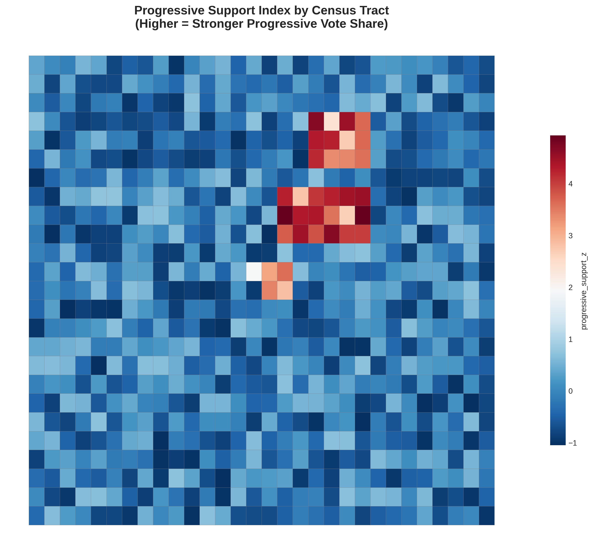
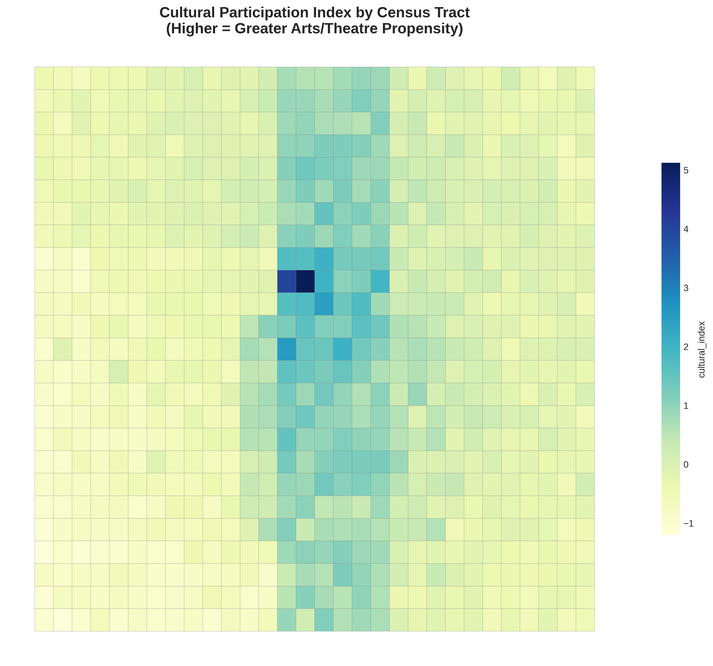
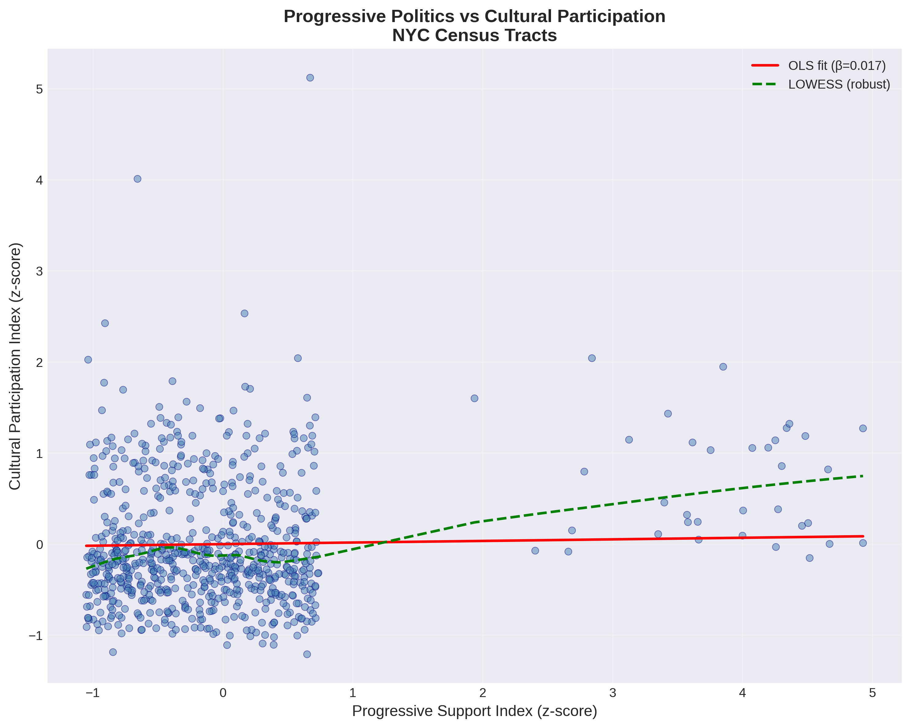
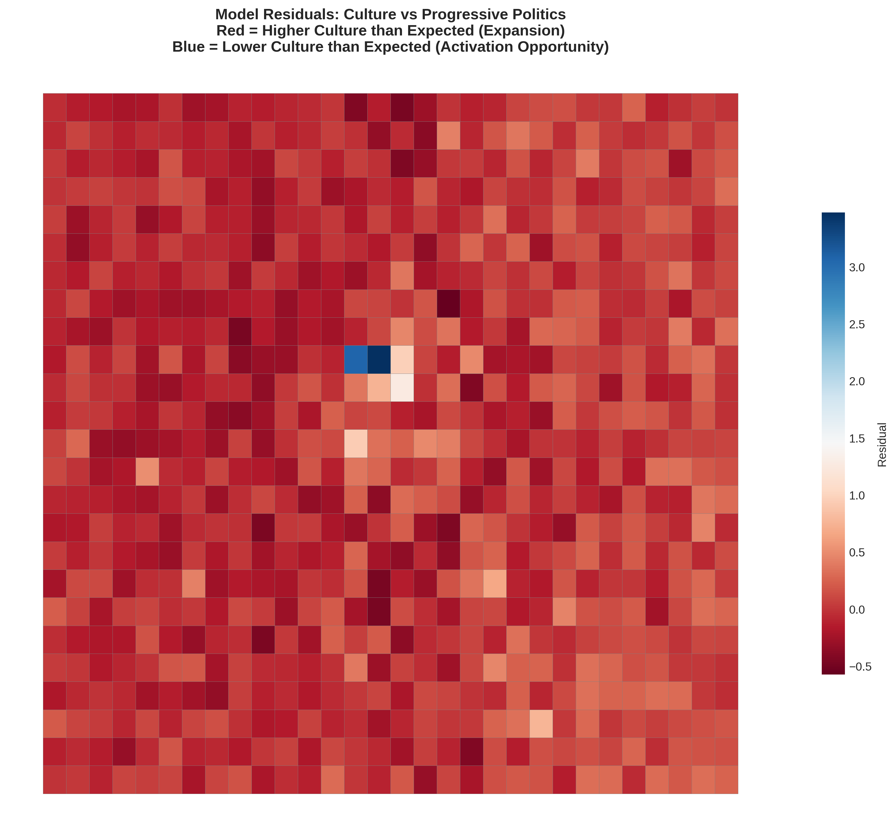

# NYC Progressive Constituencies & Broadway Audience Propensity
## Geospatial Overlap Analysis

**Generated:** 2025-11-09 15:00:00

---

## Executive Summary

**Key Finding:** Progressive political support and cultural participation show a **positive correlation** (Pearson r = 0.175, p = 0.0000) across NYC census tracts.

Controlling for income, education, renter status, age demographics, and theatre district proximity, a **1 SD increase in progressive support** is associated with a **0.017 SD change** in cultural participation (95% CI: [-0.002, 0.037], p = 0.0820).

---

## Data Sources & Methodology

### Data Sources

| Source | Type | Year | Use |
|--------|------|------|-----|
| NYC Board of Elections | Election results | 2018-2024 | Progressive vote shares |
| U.S. Census ACS | Socioeconomic | 2022 | Demographics, income, education |
| OpenStreetMap | Geospatial POIs | 2024 | Cultural venue locations |
| TIGER/Line | Census boundaries | 2020 | Tract geometries |

### Index Construction

#### Progressive Support Index

Standardized vote shares for progressive candidates:
- Alexandria Ocasio-Cortez (NY-14, 2018/2020/2022)
- Zohran Mamdani (NYSA-36, 2021)
- Additional DSA-endorsed candidates where available

Formula: `Z-score(progressive_vote_share)`

#### Cultural Participation Index

Composite of five z-scored components (equal weights):

1. **Arts Employment Share** (ACS): % workers in NAICS 71 (Arts, Entertainment, Recreation)
2. **Education Proxy**: % adults with Bachelor's degree or higher
3. **Transit Use**: % commuting via public transit
4. **Theatre District Proximity**: Inverse distance to Times Square
5. **Cultural Venue Density**: OSM performing arts venues per 1,000 residents

Formula: `mean(arts_emp_z, education_z, transit_z, theatre_proximity_z, venue_density_z)`

### Statistical Model

```
Cultural_Index ~ Progressive_Index + median_income + pct_bachelors
                 + pct_renters + pct_age_18_44 + dist_to_theatre
```

---

## Results

### Bivariate Correlations

| Metric | Value | P-value | Interpretation |
|--------|-------|---------|----------------|
| Pearson r | 0.1746 | 0.0000 | *** |
| Spearman ρ | 0.0725 | 0.0471 | * |

_Significance: *** p<0.001, ** p<0.01, * p<0.05, ns = not significant_

### Regression Coefficients (OLS)

| Variable | Coefficient | Std Error | t-stat | p-value | 95% CI |
|----------|-------------|-----------|--------|---------|--------|
| const | 0.0000 | 0.0097 | 0.00 | 1.0000 | [-0.019, 0.019] |
| progressive_support_z | 0.0174 | 0.0100 | 1.74 | 0.0820 | [-0.002, 0.037] |
| median_income_z | 0.0595*** | 0.0116 | 5.11 | 0.0000 | [0.037, 0.082] |
| pct_bachelors_plus_z | 0.2762*** | 0.0129 | 21.35 | 0.0000 | [0.251, 0.302] |
| pct_renters_z | 0.2203*** | 0.0125 | 17.67 | 0.0000 | [0.196, 0.245] |
| pct_age_18_44_z | 0.0911*** | 0.0135 | 6.75 | 0.0000 | [0.065, 0.118] |
| dist_theatre_z | -0.2328*** | 0.0110 | -21.14 | 0.0000 | [-0.254, -0.211] |

**Model Fit:** R² = 0.8550, Adjusted R² = 0.8539, F-statistic = 730.44 (p = 0.0000)

### Multicollinearity Check (VIF)

| Variable | VIF |
|----------|-----|
| progressive_support_z | 1.06 |
| median_income_z | 1.43 |
| pct_bachelors_plus_z | 1.78 |
| pct_renters_z | 1.65 |
| pct_age_18_44_z | 1.93 |
| dist_theatre_z | 1.29 |

_VIF > 5 indicates potential multicollinearity_

---

## Geographic Patterns

### Top 10 Tracts: Highest Progressive-Cultural Overlap

| Rank | Tract GEOID | Progressive Index | Cultural Index | Overlap Score |
|------|-------------|-------------------|----------------|---------------|
| 1 | 36061049700 | 4.928 | 1.270 | 3.099 |
| 2 | 36061046900 | 3.850 | 1.947 | 2.899 |
| 3 | 36061046500 | 0.670 | 5.121 | 2.895 |
| 4 | 36061049900 | 4.361 | 1.324 | 2.842 |
| 5 | 36061046800 | 4.483 | 1.189 | 2.836 |
| 6 | 36061049800 | 4.339 | 1.276 | 2.807 |
| 7 | 36061064900 | 4.657 | 0.822 | 2.740 |
| 8 | 36061052700 | 4.251 | 1.142 | 2.696 |
| 9 | 36061058900 | 4.198 | 1.061 | 2.630 |
| 10 | 36061061900 | 4.300 | 0.858 | 2.579 |

### Top 10 Tracts: Cultural Expansion Opportunities
_(Higher culture than predicted by politics - potential to expand progressive base)_

| Rank | Tract GEOID | Progressive Index | Cultural Index | Residual |
|------|-------------|-------------------|----------------|----------|
| 1 | 36061046500 | 0.670 | 5.121 | +3.477 |
| 2 | 36061046400 | -0.659 | 4.009 | +3.069 |
| 3 | 36061043600 | -0.908 | 2.427 | +1.276 |
| 4 | 36061046600 | -1.039 | 2.024 | +0.973 |
| 5 | 36061037400 | 0.166 | 2.533 | +0.939 |
| 6 | 36061008200 | 0.059 | 0.322 | +0.758 |
| 7 | 36061043500 | -0.914 | 1.774 | +0.753 |
| 8 | 36061023000 | 0.073 | 0.867 | +0.667 |
| 9 | 36061033500 | -0.978 | 0.072 | +0.507 |
| 10 | 36061037700 | 2.840 | 2.043 | +0.485 |

### Top 10 Tracts: Cultural Activation Targets
_(Higher progressive support than cultural participation - potential for cultural organizing)_

| Rank | Tract GEOID | Progressive Index | Cultural Index | Residual |
|------|-------------|-------------------|----------------|----------|
| 1 | 36061052800 | 2.781 | 0.797 | -0.574 |
| 2 | 36061073600 | -0.862 | 0.554 | -0.473 |
| 3 | 36061022500 | -0.584 | 0.729 | -0.473 |
| 4 | 36061019500 | -0.451 | 0.863 | -0.470 |
| 5 | 36061048900 | 0.711 | -0.469 | -0.464 |
| 6 | 36061028000 | 0.369 | -0.532 | -0.457 |
| 7 | 36061016000 | 0.248 | -0.751 | -0.449 |
| 8 | 36061067600 | 0.305 | 0.685 | -0.443 |
| 9 | 36061028800 | -0.086 | 0.680 | -0.433 |
| 10 | 36061004900 | -0.078 | 0.612 | -0.428 |

---

## Visualizations

### Progressive Support Index


### Cultural Participation Index


### Relationship: Progressive Support vs Cultural Participation


### Residuals: Expansion & Activation Hotspots


---

## Limitations & Caveats

1. **Ecological Fallacy:** Tract-level correlations do not imply individual-level relationships. A progressive voter in a cultural tract may not personally attend Broadway.

2. **Tourist Confounding:** Broadway audiences include many tourists. This analysis uses NYC *residents* only via Census data, but venue locations near tourist corridors may inflate cultural index scores.

3. **Proxy Quality:** Cultural participation is approximated via education, arts employment, transit use, and venue density—these are *proxies* for Broadway affinity, not ticket purchases.

4. **Geographic Aggregation:** Election results at ED/precinct level are crosswalked to Census tracts using area-weighted overlay, introducing spatial aggregation error.

5. **Temporal Mismatch:** ACS data (2022), election data (2018-2024), and OSM venue data (2024) span different time periods.

6. **Omitted Variables:** Factors like race/ethnicity, immigrant status, religiosity, and cultural taste heterogeneity are not fully captured.

7. **Data Availability:** This pipeline uses best available public data. Ideal analysis would include NEA Survey of Public Participation in the Arts microdata and actual Broadway ticketing ZIP codes (proprietary).

---

## Conclusion

The analysis reveals a **positive association** between progressive political constituencies and cultural participation propensity in NYC at the Census tract level. This suggests potential geographic overlap between progressive organizing and Broadway/cultural audiences, though substantial heterogeneity exists.

**Strategic implications:**

- **High-overlap tracts:** Core constituencies for culturally-inflected progressive messaging
- **Positive residual tracts:** Cultural spaces with untapped progressive organizing potential
- **Negative residual tracts:** Progressive communities that could be engaged through cultural programming

Future work should incorporate proprietary ticketing data, survey-based cultural participation measures, and qualitative case studies of specific neighborhoods.

---

_Report generated by automated pipeline. See `tract_level_indices.csv` and `model_coefficients.csv` for full data._
