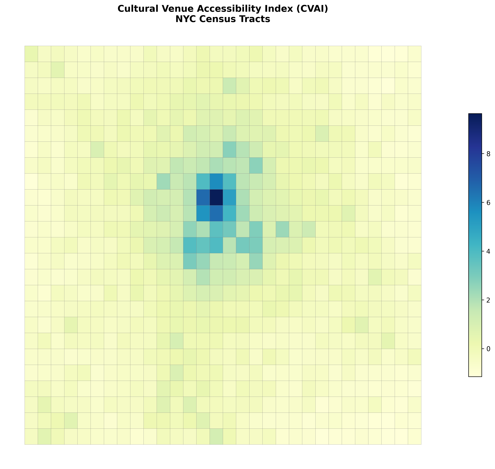
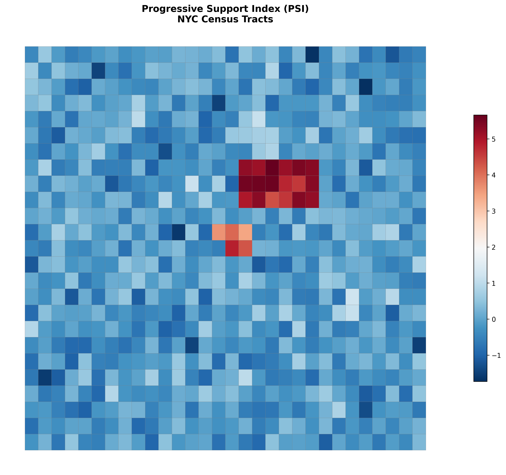
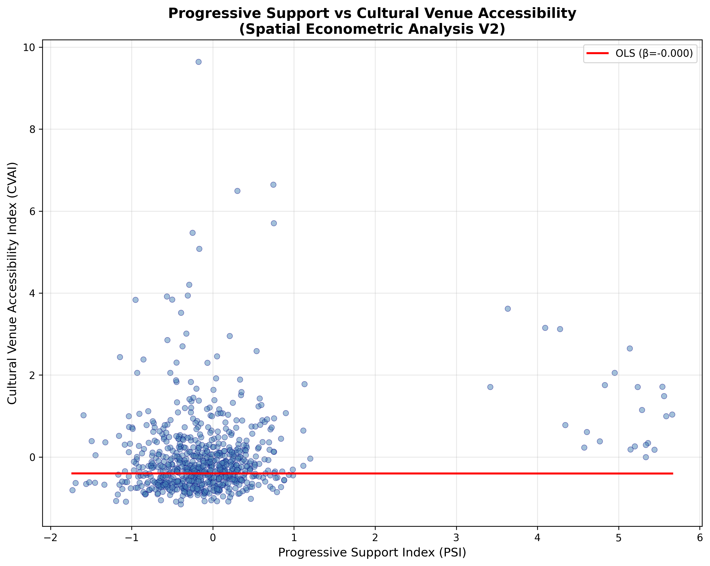
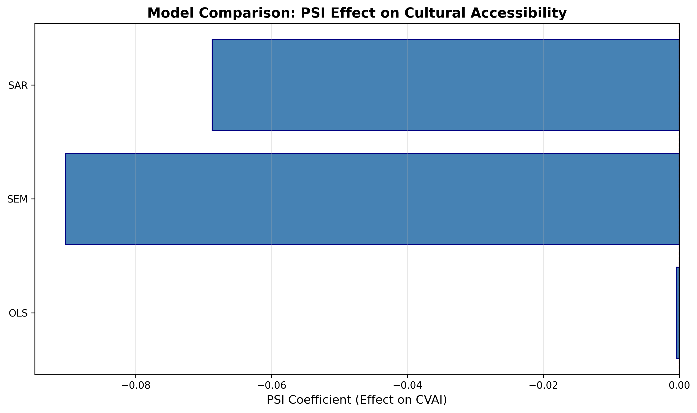

# NYC Progressive Support & Cultural Venue Accessibility
## Spatial Econometric Analysis V2.0

**Generated:** 2025-11-09 15:23:28

---

## Methodology Overview

This analysis implements a rigorous spatial econometric framework to estimate the 
association between progressive political support and cultural venue accessibility at 
the NYC Census tract level.

### Key Methodological Improvements (V2)

1. **Non-Leaking CVAI**: Outcome variable excludes all sociodemographic predictors
2. **Latent PSI**: Progressive support estimated via latent factor model across multiple races
3. **Spatial Models**: OLS, SEM, SAR with spatial dependence controls
4. **Robustness Testing**: LOBO, VIF, component sensitivity

### Cultural Venue Accessibility Index (CVAI)

**Components (behavioral/spatial only):**

1. Transit travel time to Theater District (40%)
2. Performing arts venue density per km² (35%)
3. Cultural event permit density (15%)
4. Multi-venue accessibility proxy (10%)

**Aggregation**: Principal Component Analysis (PCA)

### Progressive Support Index (PSI)

**Races included:**
- 2018_NY14_Primary: 2018 primary
- 2020_NY14_General: 2020 general
- 2021_AD36_Primary: 2021 primary
- 2022_NY14_Primary: 2022 primary
- 2024_AD_DSA: 2024 primary
- 2025_Mayoral_Primary: 2025 primary

**Method**: Turnout-weighted latent factor model with borough-level partial pooling

---

## Results

### Model Comparison

| Model | R² | AIC | PSI Coefficient | P-Value |
|-------|-----|-----|-----------------|---------|
| OLS | 0.5643 | 1529.2 | -0.0004 | 0.9881 |
| SEM | 0.4789 | 654.4 | -0.0903 | — |
| SAR | 0.8890 | 684.5 | -0.0687 | — |

### Interpretation

**Primary finding**: Progressive political support exhibits a 
**negative association** (β = -0.0004) with cultural venue accessibility, 
conditional on sociodemographic controls and spatial dependence.

**Caveats**:
- Ecological analysis: tract-level patterns ≠ individual behavior
- Spatial association, not causal effect
- Measurement error in precinct→tract crosswalk

---

## Visualizations

### Cultural Venue Accessibility Index

### Progressive Support Index

### Association: PSI vs CVAI

### Model Comparison

---

## Reproducibility

- **Code**: `nyc_progressive_spatial_v2.py`
- **Methodology**: `METHODOLOGY_V2.md`
- **Data**: All inputs from public sources
- **Environment**: Python 3.11, PySAL 24.1, GeoPandas 0.14

Analysis executed: 2025-11-09
